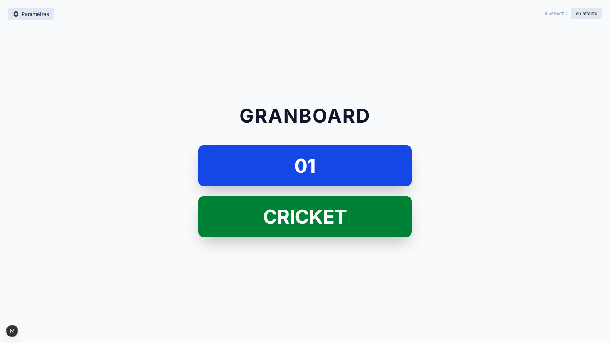
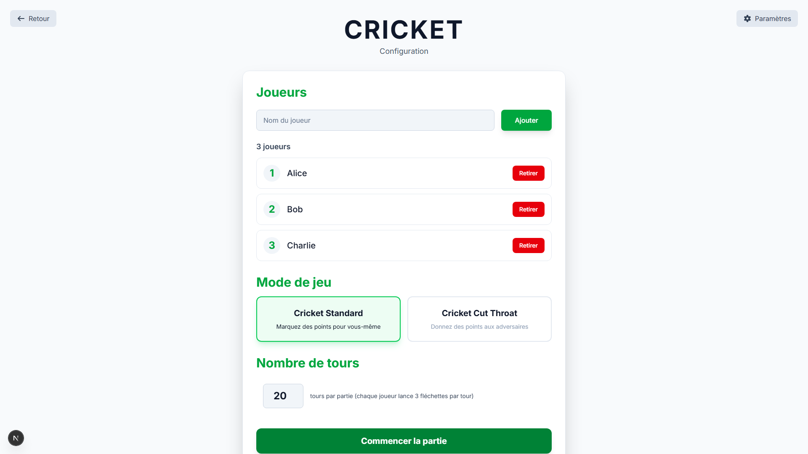
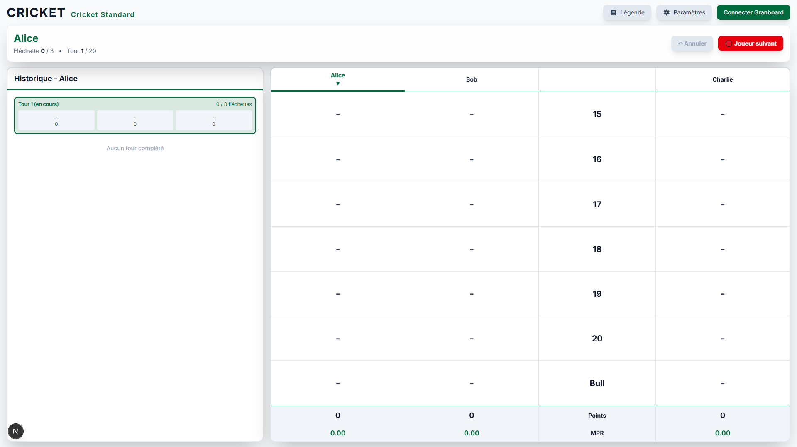
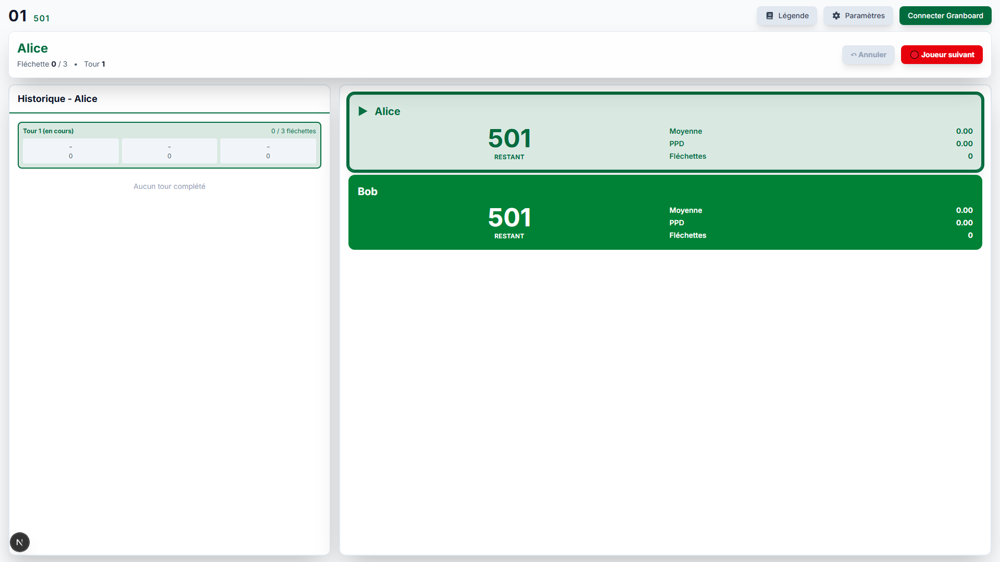
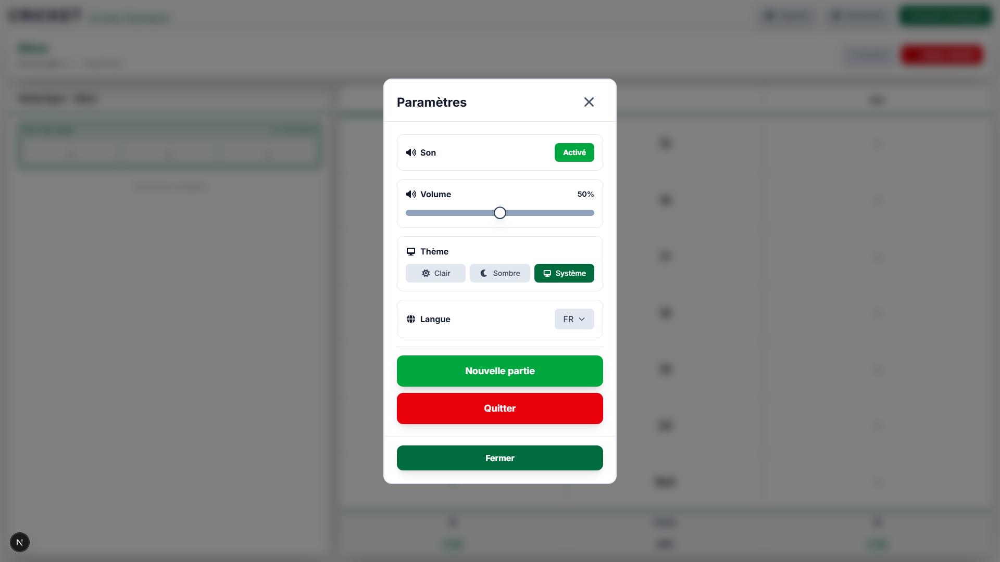

# Granboard App

A modern, feature-rich web application for Granboard electronic dartboards, built with Next.js and Web Bluetooth API.

[](https://github.com/bastiennoel93/granboard-app/actions/workflows/ci.yml)
[](https://opensource.org/licenses/MIT)
[](https://nextjs.org/)
[](https://www.typescriptlang.org/)

## Screenshots

<table>
  <tr>
    <td width="50%">
      
      <p align="center"><b>Home - Game Mode Selection</b></p>
    </td>
    <td width="50%">
      
      <p align="center"><b>Cricket - Player Setup</b></p>
    </td>
  </tr>
  <tr>
    <td width="50%">
      
      <p align="center"><b>Cricket - In-Game View</b></p>
    </td>
    <td width="50%">
      
      <p align="center"><b>01 Game - Scoreboard</b></p>
    </td>
  </tr>
  <tr>
    <td width="50%">
      
      <p align="center"><b>Settings</b></p>
    </td>
  </tr>
</table>

## Features

### Available Game Modes

- **01 Games** 
  - Classic countdown games (301, 501, etc.)
  - Player order selection (random, throw for order, manual)
  - Real-time scoreboard with marks tracking
  - Undo functionality
  - Game history tracking

- **Cricket**
  - Standard Cricket gameplay
  - Cut-throat mode
  - Player order selection (random, throw for order, manual)
  - Real-time scoreboard with marks tracking
  - MPR (Marks Per Round) statistics
  - Undo functionality
  - Game history tracking


### Core Features

- **Web Bluetooth Integration** - Direct connection to Granboard devices
- **Real-time Scoring** - Instant dart detection and scoring
- **Sound Effects & Animations** - Immersive audio feedback and visual effects for special achievements
- **Theme Support** - Light and dark mode with smooth transitions
- **Internationalization** - Full support for English and French
- **Responsive Design** - Works seamlessly on desktop and mobile devices
- **Modern UI** - Clean, intuitive interface built with Tailwind CSS v4
- **Type Safety** - Full TypeScript implementation for reliability
- **Comprehensive Testing** - Unit tests (Jest) and E2E tests (Playwright)
- **Game History** - Complete turn-by-turn history with undo functionality

## Prerequisites

- **Node.js** 18.x or higher
- **pnpm** package manager
- **Granboard** electronic dartboard (3, 3s, or 132 model)
- **Modern Browser** with Web Bluetooth support (Chrome, Edge, or Opera)

## Installation

1. Clone the repository:

```bash
git clone https://github.com/bastiennoel93/granboard-app.git
cd granboard-app
```

2. Install dependencies:

```bash
pnpm install
```

3. Run the development server:

```bash
pnpm dev
```

4. Open [http://localhost:8080](http://localhost:8080) in your browser

## Usage

### Connecting to Granboard

1. Click on your desired game mode (01 or Cricket)
2. Click the "Connect to Board" button in the game
3. Select your Granboard device from the browser's Bluetooth pairing dialog
4. Start playing!

### Playing 01 Games (301, 501, 701)

1. Select **01** from the home screen
2. Choose your game mode (301, 501, or 701)
3. Add players
4. Select game options:
   - **Double Out** - Must finish on a double
   - **Max Rounds** - Optional round limit
5. Choose player order (random, throw for order, manual, or current)
6. Click "Start Game"
7. Connect your Granboard and start playing!

**Game Features:**
- Real-time score updates
- Automatic bust detection
- Statistics (Average, PPD)
- Turn history with undo functionality
- Victory animations and sound effects

### Playing Cricket

1. Select **Cricket** from the home screen
2. Choose game mode:
   - **Standard** - Score points after closing numbers
   - **Cut Throat** - Give points to opponents
3. Add players
4. Set max rounds (default: 20)
5. Choose player order (random, throw for order, manual, or current)
6. Click "Start Game"
7. Connect your Granboard and start throwing!

**Game Features:**
- Real-time marks tracking (visual indicators)
- MPR (Marks Per Round) statistics
- Turn history with detailed hit breakdown
- Undo functionality
- Special animations (Three in a Bed, Hat Trick)
- Sound effects for hits and achievements

### Settings & Customization

- **Theme** - Switch between light and dark mode
- **Volume** - Adjust sound effects volume
- **Sound** - Enable/disable sound effects
- **Language** - Switch between English and French

## Development

### Project Structure

```
granboard-app/
├── app/                           # Next.js app directory
│   ├── components/               # Shared UI components
│   │   └── Card.tsx             # Reusable game card component
│   ├── contexts/                # React contexts
│   │   └── SettingsContext.tsx  # Global settings (theme, sound, volume)
│   ├── hooks/                   # Shared custom hooks
│   │   └── useAnimations.tsx    # Animation system hook
│   ├── cricket/                 # Cricket game module
│   │   ├── components/         # Cricket setup components
│   │   └── game/               # Cricket game implementation
│   │       ├── components/     # Game UI components
│   │       └── hooks/          # Game-specific hooks
│   ├── 01/                      # 01 games module (301, 501, 701)
│   │   ├── components/         # 01 setup components
│   │   └── game/               # 01 game implementation
│   │       ├── components/     # Game UI components
│   │       └── hooks/          # Game-specific hooks
│   ├── [locale]/               # Internationalization routing
│   └── page.tsx                # Home page
├── services/                    # Business logic & game engines
│   ├── granboard.ts            # Bluetooth connection service
│   ├── boardinfo.ts            # Segment definitions & enums
│   ├── cricket.ts              # Cricket game engine
│   └── zeroone.ts              # 01 games engine
├── constants/                   # Centralized constants
│   ├── segments.ts             # Segment types and utilities
│   ├── animations.ts           # Animation timing constants
│   ├── sounds.ts               # Sound file paths
│   └── storage.ts              # Session storage keys
├── messages/                    # Internationalization files
│   ├── en.json                 # English translations
│   └── fr.json                 # French translations
├── __tests__/                   # Unit tests
├── e2e/                        # E2E tests with Playwright
│   ├── take-screenshots.spec.ts  # Screenshot generator
│   └── *.spec.ts               # E2E test suites
├── public/                     # Static assets
│   └── assets/                # Images and sounds
└── docs/                       # Documentation
    └── screenshots/            # README screenshots
```

### Key Directories Explained

- **`app/`** - Next.js 16 App Router structure with internationalization
- **`services/`** - Pure TypeScript game logic, independent of UI
- **`constants/`** - Centralized constants for maintainability (added during refactoring)
- **`contexts/`** - Global state management (settings, theme, sound)
- **`hooks/`** - Reusable React hooks for common functionality
- **`e2e/`** - End-to-end tests including automated screenshot generation

### Available Scripts

```bash
# Development
pnpm dev              # Start dev server
pnpm build            # Build for production
pnpm start            # Start production server
pnpm lint             # Run ESLint

# Testing
pnpm test             # Run unit tests
pnpm test:watch       # Run unit tests in watch mode
pnpm test:coverage    # Generate coverage report
pnpm test:e2e         # Run E2E tests
pnpm test:e2e:ui      # Run E2E tests with UI
pnpm test:e2e:debug   # Debug E2E tests
```

### Key Technologies

- **Framework:** [Next.js 16](https://nextjs.org/) - React framework with App Router
- **Language:** [TypeScript](https://www.typescriptlang.org/) - Type-safe JavaScript
- **Styling:** [Tailwind CSS v4](https://tailwindcss.com/) - Utility-first CSS framework
- **Bluetooth:** [Web Bluetooth API](https://developer.mozilla.org/en-US/docs/Web/API/Web_Bluetooth_API) - Direct device communication
- **Testing:** [Jest](https://jestjs.io/) + [Playwright](https://playwright.dev/) - Unit and E2E testing
- **CI/CD:** [GitHub Actions](https://github.com/features/actions) - Automated testing and deployment

### Web Bluetooth API

This app requires a browser with Web Bluetooth support:

- ✅ Chrome (Desktop & Android)
- ✅ Edge (Desktop)
- ✅ Opera (Desktop & Android)
- ❌ Firefox (not supported)
- ❌ Safari (not supported)

**Note:** HTTPS or localhost is required for Web Bluetooth to work.

## Testing

### Unit Tests

Unit tests are located in the `__tests__` directory and test individual components and services.

```bash
pnpm test              # Run all tests
pnpm test:watch        # Watch mode
pnpm test:coverage     # With coverage report
```

### E2E Tests

End-to-end tests are located in the `e2e` directory and test complete user workflows.

```bash
pnpm test:e2e          # Run all E2E tests
pnpm test:e2e:ui       # Interactive UI mode
pnpm test:e2e:debug    # Debug mode
```

## Roadmap

- [x] Add 01 game modes (301, 501, 701)
- [x] Add sound effects and animations
- [x] Support for multiple languages (EN/FR)
- [x] Dark/light theme toggle
- [x] Player turn history tracking
- [x] Undo functionality for both games
- [ ] Implement practice mode with training exercises
- [ ] Add party games (Shanghai, Around the Clock, etc.)
- [ ] Create match mode for tournaments
- [ ] Build AI opponent system
- [ ] Add player profiles and statistics tracking
- [ ] Implement game replay functionality

## Contributing

Contributions are welcome! Please feel free to submit a Pull Request.

### How to Contribute

1. Fork the repository
2. Create a feature branch (`git checkout -b feature/amazing-feature`)
3. Make your changes
4. Run tests (`pnpm test && pnpm test:e2e`)
5. Run linter (`pnpm lint`)
6. Commit your changes (`git commit -m 'Add amazing feature'`)
7. Push to the branch (`git push origin feature/amazing-feature`)
8. Open a Pull Request

### Code Style

- Follow TypeScript best practices
- Use ESLint configuration provided
- Write tests for new features
- Keep components small and focused
- Use meaningful variable and function names

## License

This project is licensed under the MIT License - see the [LICENSE](LICENSE) file for details.

## Acknowledgments

- [Granboard](https://www.gran-darts.com/) for creating amazing electronic dartboards
- The Next.js team for an excellent React framework
- All contributors who help improve this project

## Support

If you encounter any issues or have questions:

- Open an [issue](https://github.com/bastiennoel93/granboard-app/issues)
- Check existing issues for solutions
- Review the [Web Bluetooth API documentation](https://developer.mozilla.org/en-US/docs/Web/API/Web_Bluetooth_API)

---

**Made with ❤️ by the Granboard community**
